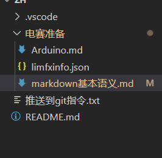

# 根据郑老师的视频制作的markd写作方法汇总
[本文所有使用方法均来自于此链接](https://www.limfx.pro/ReadArticle/57/yi-zhong-xie-zuo-de-xin-fang-fa)


## 换行、换段、强调字体、自动编号、插入图片等功能
正文中直接敲击回车键不代表换行，两行正文中间再加一个回车键代表下一段，想直接换行就是两个空格加一个回车
dasd

这是第二段


**这是加粗字体**
*这是倾斜字体*


1. 啊哈哈哈
2. 自动编号，敲完序号记得加空格
   1. 二级标题




### 插入公式、表格、链接、代码段

1. 关于公式插入
   Ctrl+M  美元符号，按两次单独一行显示要打的公式，在文中按一次 $lim_{x \to \infin}f(x)$  


### 添加一个表格

| 小明  | 小黄  | 小张  |
| :---: | :---: | :---: |
|  77   |  88   |  99   |

Alt+Shift+F   将文本中排版比较难看的表格类文本自动排版
| 小明  | 小黄  | 小张  |
| :---: | :---: | :---: |              
|  77   |  88   |  99   |


### 插入一个链接

这是一个[链接](https://www.bilibili.com/video/BV1si4y1472o)


### 代码段

```c
#include<stdio.h>
void main()
{
   printf("这是一个C语言的代码段");
}
```
